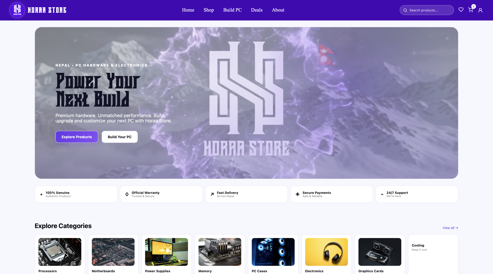
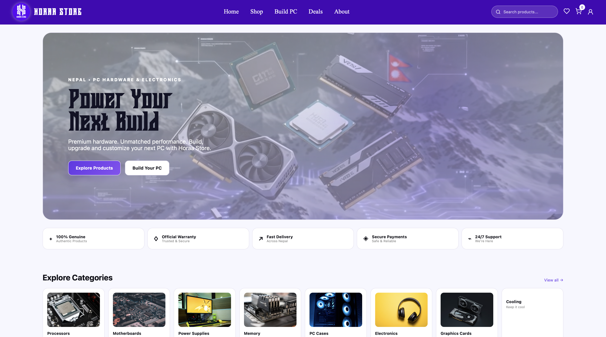
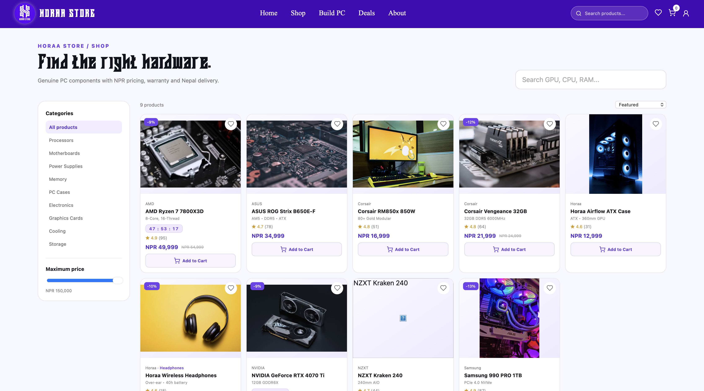

# HORAA STORE  


<p align="center">
  
</p>

<p align="center">
  
  
</p>

Modern Nepal-focused PC hardware and electronics ecommerce platform built around the supplied Horaa Store design.

## Stack
- Frontend: Next.js 15, React 19, TypeScript, CSS
- Backend: Python FastAPI
- Development DB: SQLite
- Production DB direction: PostgreSQL
- Container support: Docker / Docker Compose

## Features across all stages
- Premium light lavender/white storefront
- Himalayan technology branding and local assets
- Product catalog, search, category filters and price filters
- Product details, reviews and wishlist
- Cart and checkout
- NPR pricing
- COD + payment gateway selection placeholders
- Coupon system
- Customer authentication and account area
- Saved PC builds and PC Builder compatibility checks
- Admin dashboard, orders, products, inventory and analytics
- Stock validation and order status workflow
- Responsive mobile UI

## Run locally

### Backend
```bash
cd backend
python3 -m venv .venv
source .venv/bin/activate
pip install -r requirements.txt
cp .env.example .env
uvicorn app.main:app --reload --port 8000
```
API: http://localhost:8000/docs

### Frontend
```bash
cd frontend
npm install
npm run dev
```
Store: http://localhost:3000

## Admin
Set `ADMIN_TOKEN` in `backend/.env`, then visit `/admin` and enter the token.

## Assets
- `frontend/public/assets/horaa-himalaya-hero.png` — main light Himalayan hero artwork
- `frontend/public/assets/horaa-himalaya-tech-dark.png` — dark cinematic technology artwork
- `frontend/public/assets/horaa-logo.png` — supplied Horaa logo
- `docs/horaa-ui-reference.png` — supplied design reference

## Production checklist
1. Use PostgreSQL and migrations.
2. Store product images in object storage/CDN.
3. Add real eSewa/Khalti/Fonepay merchant integrations with signed callbacks.
4. Add HTTPS, secure cookies/tokens, rate limiting and CSRF protections where applicable.
5. Add email/SMS/WhatsApp notifications.
6. Add delivery zones, shipping rules and return/refund workflow.
7. Add backups, monitoring, logging and audit trails.
8. Replace all demo credentials and placeholder contact details.

See `docs/PROJECT.md` for the complete stage breakdown.
